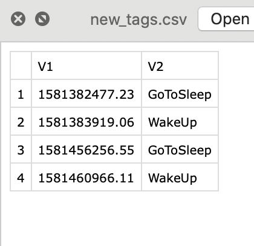

```{r setup, include=FALSE}
knitr::opts_chunk$set(echo = TRUE)
```

## Instruction for data upload

We wrote a function for data import and cleaning, thus we need to standardize the raw data format. Please read the following instruction and re-upload your data.

### Folder Name
Your folder should be names as "FirstnameLastname," for instance, "BangyaoZhao" and "NingyuanWang". Then, you can upload you data in the folder named as "data", which is inside the "620-GOGOGO" folder.

### Foler Content
Do NOT change any data file except the tags.csv (mentioned in next section), only the original folder is perfect. Do NOT make any subfolders. ONLY upload following files: ACC.csv, EDA.csv, HR.csv, TEMP.csv for the sake of storage. You can check the folder LitianZhou for reference.

### Requirement for tags.csv
We will only require the tags of GoToSleep and WakeUp (in CamelCase) with notation, named as "new_tags.csv". 

You can edit it use Excel or any text editor. It is preferred that you add an empty line at the bottom to avoid warning during data import.

Optionally, you can add activities which interest you like running, exam, or drinking coffee. The only requirement is that you can make sure its timing according to your diary.

\newpage
# You do not need to read this
```{r}
# change to your own directory
tags <- read.table("../data/QingzhiLiu/tags.csv", quote="\"", comment.char="")
new_tags = cbind(tags[8:9,],
                 c("GoToSleep", "WakeUp"))

# If you have multiple sleeping periods, including naps
# please include all of them in one tags.cvs
new_tags = cbind(tags[c(8:9, 17:18),],
                 c("GoToSleep", "WakeUp"),
                 c())

# export into a new file named new_tags.csv
write.csv(new_tags, file = "new_tags.csv")
```

Optionally, you can add activities which interest you like running, exam, or drinking coffee. The only requirement is that you can make sure its timing according to your diary. You need to notate them as following example:
```{r}
# change to your own directory
tags <- read.table("../data/LitianZhou/tags.csv", quote="\"", comment.char="")
new_tags = cbind(tags[c(3, 5:6),],
                 c("Running","GoToSleep", "WakeUp"))
write.csv(new_tags, file = "new_tags.csv")
```


